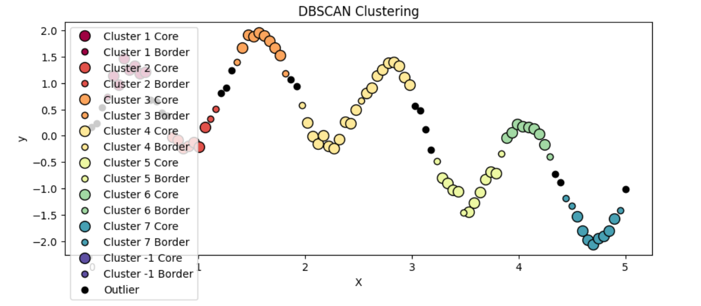

# Clustering
This repository holds a few different practice projects in which I created clustering models (from scratch, without using sklearn) to practice different methods.



You can find here:

1. KMeans (distributed with Spark)
2. KMedoids (allows choice between kmeans and kmedoids)
3. DBScan
4. OPTICS

Operate in git:

```
git init
git remote add origin https://github.com/shaharoded/Clustering.git
git remote -v
git add .
git commit -m "message"
git push -u origin main
````